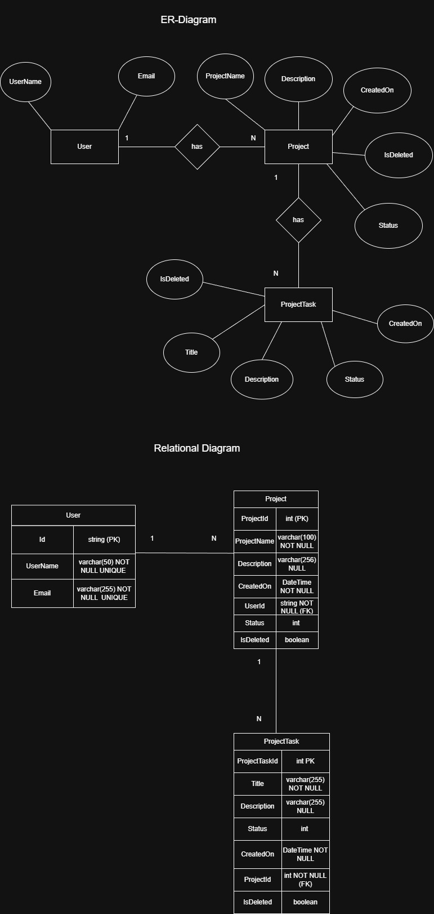

# ProjectManagement

ASP.NET Core MVC web application for managing projects and tasks.

## Technologies
- ASP.NET Core MVC
- Entity Framework Core
- SQL Server
- ASP.NET Identity

## Features
- User registration and login
- Authentication with ASP.NET Identity
- User-specific projects
- CRUD operations for projects

## Planned Features
- Task management
- Improved UI
- Project status system

## Design Concepts: Entity-Relationship Diagram, Relational Diagram

---

## Hinweis

Dieses Projekt wurde als Lernprojekt im Rahmen einer praxisnahen Aufgabenstellung erstellt.
